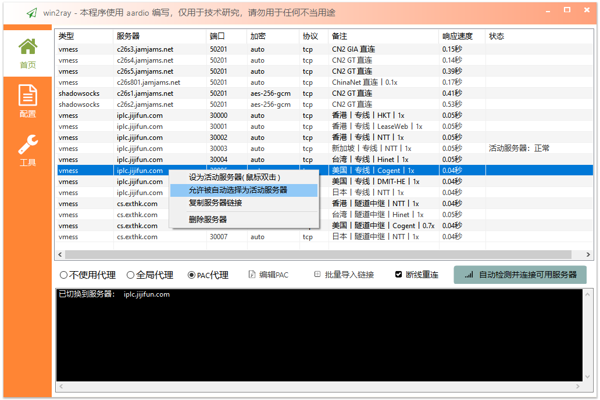
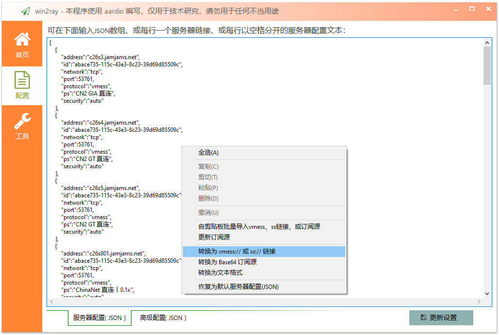
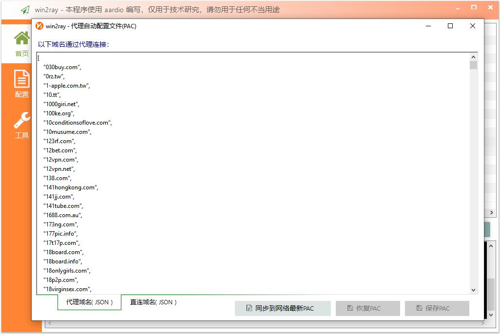

# win2ray 
简洁稳定的 V2Ray（兼容Shadowsocks） Windows 客户端，
支持自动检测可用的代理服务器、断线自动更换服务器。本程序使用 [aardio](http://www.aardio.com) 编写，不需要.Net运行库，生成的EXE非常小。    
 
win2ray 可自动并选择响应最快的代理服务器尝试连接，连接成功立即模拟浏览器检测访问国外网站是否异常，异常则自动更换代理服务器：  

可导入导出各种格式的服务器配置，支持json、vmess链接、ss链接、文本表格格式服务器列表、订阅链接等。  
可选在 ["/v2ray-core/win2ray-default-servers.json"](./v2ray-core/win2ray-default-servers.json) 文件中添加默认服务器配置（生成EXE后默认配置自动嵌入到EXE文件，可选删除该文件,也可以继续使用该文件覆盖EXE自带的默认服务器列表）。

软件首次运行时会在当前目录查找 "./v2ray-core/v2ray.exe"   
发行文件仅需要 "./win2ray.exe"，可选带上 "./v2ray-core/" 目录（ 如果没有找到会自动到v2ray官网下载，不过没有代理服务器下载有时候非常慢 )。

